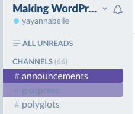
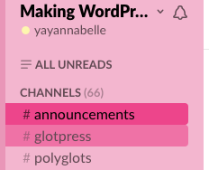
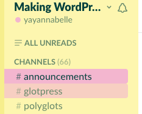
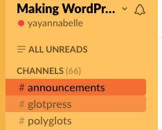
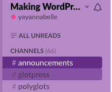
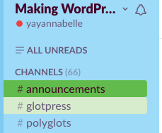

# mlp-slack-themes
My Little Pony inspired Slack themes! Making your Slack sidebar look 20% cooler.

#Credits
* Hex code credit belongs to [kefkafloyd on dA](http://kefkafloyd.deviantart.com/gallery/28942848/My-Little-Pony-Friendship-is-Magic-Color-Guides). I've just arranged them for Slack and made screenshots.
* Text/background colour combinations have been checked for high enough contrast ratio (all are Level AA and above) using this [super helpful tool](http://leaverou.github.io/contrast-ratio/) by @LeaVerou .
* Themes tested using [Slack Themes](https://github.com/paracycle/slackthemes) by @paracycle .

##Mane Six
###Rarity

    #ebeff1,#5e4fa2,#5e4fa2,#FFFFFF,#5e4fa2,#214871,#7ad2f9,#1e98d3
###Pinkie Pie

    #F3B6CF,#ED458B,#ED458B,#000000,#ED458B,#000000,#FDF6AF,#80D1F6
###Fluttershy

    #FDF6AF,#F3B6CF,#F3B6CF,#03403D,#F3B6CF,#03403D,#F3B6CF,#68C8C6
###Applejack

    #FFC261,#F26F31,#F26F31,#000000,#F26F31,#000000,#EE4043,#65BB4D
###Twilight Sparkle

    #B689C8,#662D8A,#662D8A,#ffffff,#662D8A,#000000,#ED438A,#ED438A
###Rainbow Dash

    #9EDBF9,#672F89,#62BC4D,#000000,#FDF6AF,#460025,#EE4144,#1E98D3

##Ponyville
*Under construction!*

##Canterlot
*Under construction!*

###Princess Celestia

###Princess Luna

##Crystal Empire
*Under construction!*
